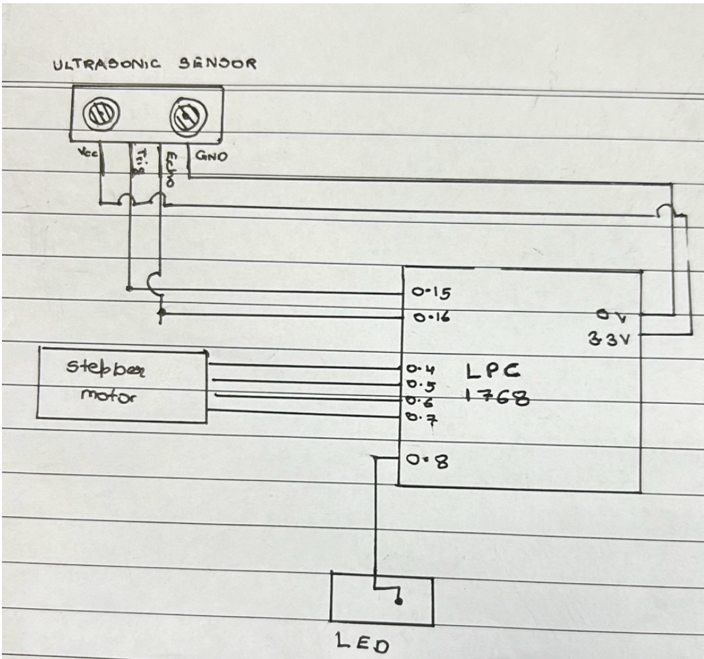
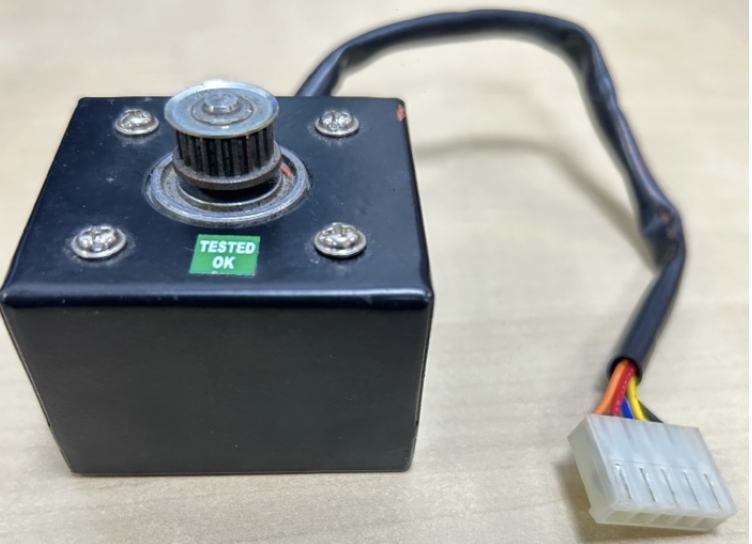

# CleanTech Bin | Smart Dustbin

## Overview
CleanTech Bin is an automated waste management system designed to optimize waste collection and enhance sanitary conditions. This system utilizes an LPC1768 microcontroller and an HC-SR04 ultrasonic sensor to detect waste levels and automate the waste collection process with a stepper motor.

## Features
- **Ultrasonic Sensing**: Uses an HC-SR04 sensor to measure waste levels without physical contact, maintaining hygiene.
- **Automated Lid Operation**: The stepper motor, controlled by the LPC1768 microcontroller, automatically opens and closes the bin lid based on waste proximity.
- **LED Indicators**: Includes an LED system that signals the operational status and waste level detection.

## Components
- LPC1768 Microcontroller
- HC-SR04 Ultrasonic Sensor
- Stepper Motor
- LEDs
- Resistor (for LED current limiting)

## Circuit Diagram

## Hardware Setup
The hardware setup includes the LPC1768 microcontroller connected to a stepper motor and an ultrasonic sensor. The stepper motor is used for lid control, while the ultrasonic sensor detects the waste level.

## Software Development
The system is programmed in Embedded C using Keil uVision and Flash Magic tools. The main functionalities include distance measurement, motor control, and system status indication.

## Code Explanation
The repository includes the complete source code with comments explaining the functionality of each segment. The code is structured around a main loop that continuously measures the distance to the waste using the ultrasonic sensor and controls the stepper motor accordingly.

### Key Functions
- `initTimer0()`: Configures the timer used for ultrasonic sensor timing.
- `startTimer0()`: Starts the timer for echo pulse measurement.
- `stopTimer0()`: Stops the timer and calculates the echo pulse duration.
- `delayUS()`: Provides precise microsecond delays.
- `controlStepperMotor()`: Controls the stepper motor's direction and steps.
- `rotateOnceClockwise()`: Rotates the stepper motor one step clockwise.
- `rotateOnceAnticlockwise()`: Rotates the stepper motor one step anticlockwise.

## Stepper Motor Image

## Installation
1. Clone the repository to your local machine.
2. Open the project in Keil uVision.
3. Connect your LPC1768 microcontroller to your computer.
4. Compile the code and upload it to the microcontroller using Flash Magic.

Feel free to reach out if you have any questions or suggestions!

- **LinkedIn**: [linkedin.com/in/avij07](https://www.linkedin.com/in/avij07)
- **Email**: avijaiswaljsr@outlook.com
